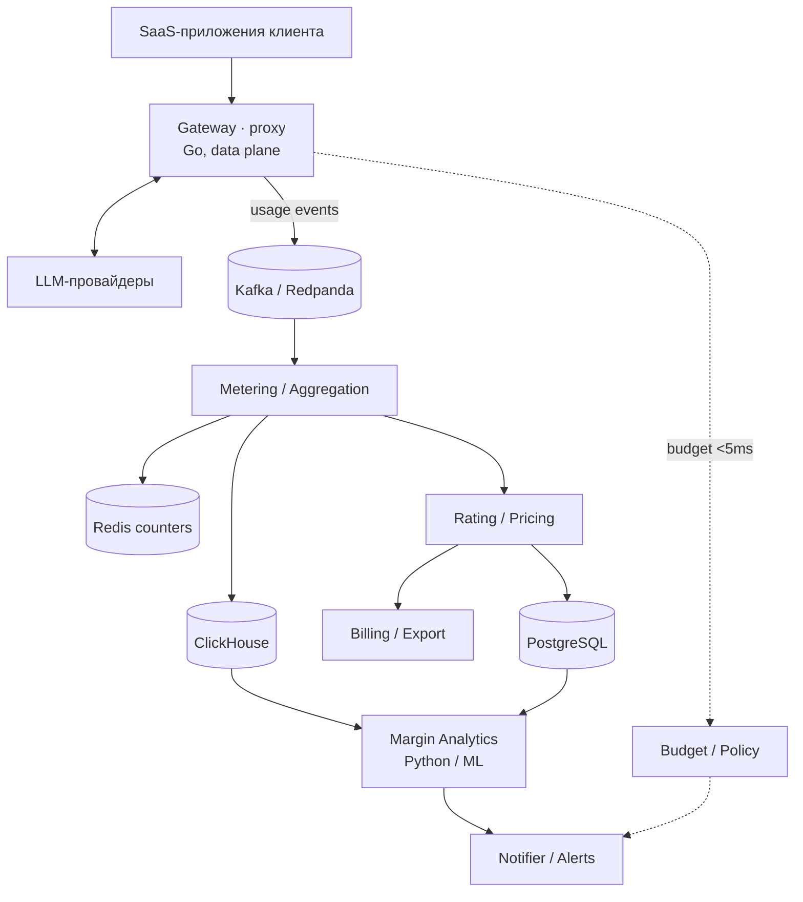

# Architecture

MarginPilot is split by **load profile**, not by fashion. Three planes have
genuinely different SLAs, so they scale and fail independently.

## Planes

| Plane | Services | Load profile | Scaling strategy |
|-------|----------|--------------|------------------|
| Data plane | gateway | Latency-critical, high rps, streaming | Stateless, horizontal behind LB |
| Processing | ingestion*, metering | High throughput, at-least-once | Partitioned consumers, backpressure |
| Control plane | budget, rating, billing, identity | Strong consistency, transactional | Per-service Postgres, modest scale |
| Analytics | analytics (Python) | Batch/near-real-time, ML | Read replicas of ClickHouse |

\* ingestion for direct-SDK events is folded into the gateway path for now.

## Key decisions

- **Hexagonal (ports & adapters)** in every Go service. The core (`internal/app`)
  depends on interfaces in `internal/port`; infrastructure lives in
  `internal/adapter`. This is why the gateway core is unit-tested with fakes and
  the echo provider / stdout publisher can become OpenAI / Redpanda with no core
  change.
- **Event-driven + CQRS.** The write path (usage ingestion) is decoupled from the
  read path (aggregates, margin) by the backbone. Metering owns the projection.
- **Usage event is the contract.** `shared/events.UsageEvent` is the one schema
  the producer and every consumer agree on, versioned via the topic name
  (`usage.events.v1`).
- **Best-effort emission on the hot path.** A backbone hiccup logs and continues;
  it never fails a user's LLM request.
- **Idempotency.** Events carry an `EventID`; ClickHouse inserts and Stripe
  exports dedupe on it, giving effectively-once semantics over at-least-once
  delivery.

## Polyglot on purpose

Go for the high-throughput core (gateway, metering, control plane); Python for the
ML/analytics surface (forecasting, anomaly detection). The backbone and the shared
event schema are the seam between them.
